# PS_NetworkMapper

A fast-access dashboard for a Juniper (Junos) switch fleet. Point it at one switch, and a few minutes
later you have the whole fleet in a browser tab: the topology graph, every chassis drawn port-by-port,
every learned client, every device's running config — and, once you have more than one crawl on disk,
what changed between them.

It is a PowerShell script and a static HTML page. Nothing to install, no database, no SNMP, no agent
on anything, no licence to buy — the only long-running process is a localhost web server that lives as
long as the window you started it in. You run it from your own laptop, with your own switch login, and
Ctrl+C it when you're done.

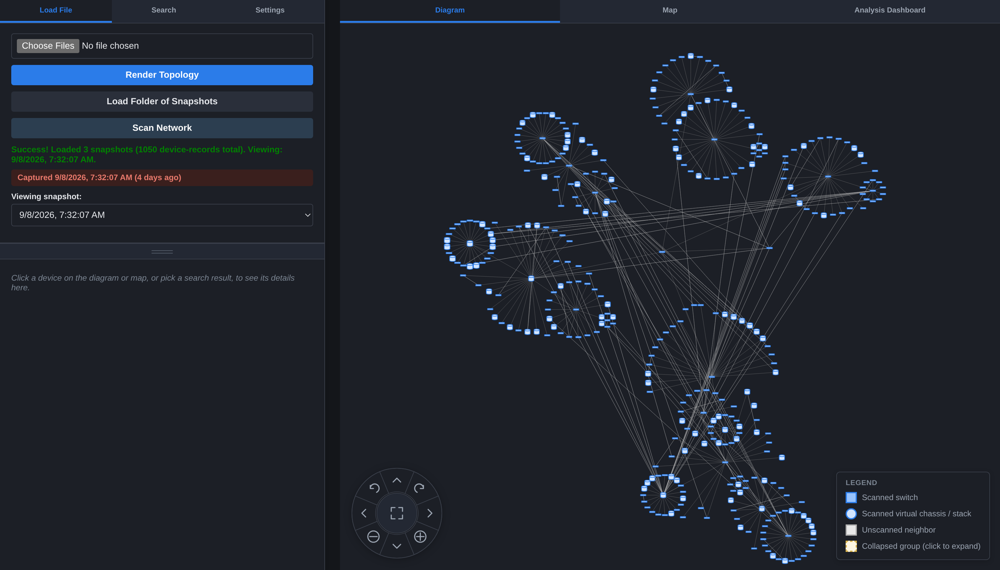

---

## What this is (and what it isn't)

This is a **convenience layer over the terminal**, not a replacement for one, and not a monitoring
platform. The job it does is shortening the distance between a question and its answer:

> *Which switch is this MAC on? Which port? Is that port even up? What changed on this box since
> Tuesday? Where is it physically? — now open a shell on it.*

Answering those from a terminal means logging into a switch, remembering whether it's
`show ethernet-switching table` or `show lldp neighbors detail`, reading it, and then doing it again
on the next box. Answering them from a monitoring platform means having a monitoring platform: a VM,
a database, SNMP communities on every device, and a project to keep it alive.

PS_NetworkMapper sits in between. It borrows the terminal's model — your credentials, your session, no
service left running — and puts a queryable snapshot of the fleet in front of it. The **Launch SSH
Session** button on every device is the point: the dashboard is where you decide *which* box to open,
and then it gets out of the way.

**It does not** monitor, alert, poll continuously, page anyone, store anything centrally, or replace
your terminal, your config-backup system, or your NMS. A crawl is a point-in-time snapshot you
deliberately took.

---

## Project Goals

The work in progress is a **derived-analysis layer** over snapshots you have already taken: given two
endpoints, say what the Layer 2 path between them is and what is wrong with it — *why can't switch A
reach switch B, or client C reach the network?* It stays inside the limits above. Nothing polls,
nothing alerts, nothing probes the network actively, and the collected running config stays out of the
analysis entirely (it is kept for backup and manual review, not parsed into rules). Every output is
evidence with a stated confidence, the same way the Local Accounts tab is a review aid rather than a
verdict.

Four pieces, none of them speculative about the data — they read what a crawl already captures:

- **Endpoint resolution from whatever identifier you have.** Management IP, hostname, serial, client
  IP, client MAC, 802.1X username, port description, switch-and-port, or an LLDP-MED endpoint. Every
  ambiguity is an explicit outcome rather than a guess: the same MAC seen on two access ports, a
  hostname that isn't unique, an IP with no MAC sighting, a device whose scan failed.
- **L2 path computation between two endpoints.** Physical adjacency pruned per-VLAN by the spanning
  tree state each port actually reports for that VLAN's scope, with a confidence level per hop —
  down to "this VLAN has no spanning-tree instance here, so the hop is unpruned". Paths are
  enumerated, not tie-broken: more than one surviving path is reported as `AMBIGUOUS`, and none is
  `NO_PATH` with the last verified hop and a specific reason.
- **A mostly table-driven rule engine** over the per-port data now retained. Most rules are a one- or
  two-field comparison expressed as a table row; only genuinely multi-hop rules get a function. The
  guarantee that matters is the negative one: each rule declares what it needs, and when that data
  was never captured — a truncated scan, a device that didn't answer — the result is `NOT_EVALUATED`,
  never a pass. Of roughly 117 catalogued rules, about 44 are answerable from today's data.
- **An analysis view in the viewer**, with the computed path highlighted on the topology graph and
  per-hop links into the device drawer.

Built so far: the data retention work (the spec's Phase 1 items R1–R15) and the Phase 2 correctness
fixes, so the per-port detail the rules need is in the snapshot; a test bed with a real spanning tree
in the fixture generator, fault injection with a manifest per snapshot, and twelve hand-built
micro-topologies; the port-level topology graph, which keeps LAG bundles and virtual chassis as single
hops and marks where the fleet ends instead of inventing links past it; and endpoint resolution over
all nine identifier types, with every ambiguity reported rather than resolved.

Not built yet: path computation, the rule engine, the Phase 3 crawl command changes the Layer 2/3
rules depend on, and the UI. The design, the evidence behind it, and the
mistakes already caught in review are in [docs/diagnostics-spec.md](docs/diagnostics-spec.md).

---

## Quick start

```powershell
cd PS_NetworkMapper

# First run: open the viewer, then set your switch login and allowed scopes in Settings
.\Start-NetworkMapper.ps1

# After that: crawl the fleet starting at a switch, then open the viewer
.\Start-NetworkMapper.ps1 -SwitchIP 192.0.2.1
```

The first run prompts for an encryption password, then opens `http://localhost:8787`. Two things go
in the **Settings** tab before your first crawl, and both are then saved — encrypted — for next time:

1. **Your Juniper login.** Yours, not a shared one; see [accountability](#you-supply-your-own-credentials--there-is-no-shared-account).
2. **Allowed scopes** — the IPv4 prefixes the crawl may follow, one per line (`10.4.`, `192.0.2.`).
   This is the fence that stops a crawl walking LLDP neighbors off your network, and it also gates
   Rescan and Launch SSH Session. There is **no default**: until you set it, nothing can be crawled or
   connected to, and the crawl refuses to start rather than run unbounded. No network prefix is baked
   into this repository.

Requirements: Windows PowerShell 5.1 (with .NET Framework 4.7.2+) or PowerShell 7+, and OpenSSH's
`ssh.exe` on `PATH`. Nothing else.

### Parameters

| Parameter | Default | Description |
|---|---|---|
| `-SwitchIP` | *(none)* | Seed IP to start crawling from. Omit to launch the viewer only, against existing snapshots. |
| `-MaxConcurrent` | `25` | Max concurrent SSH sessions during a crawl (1–64). |
| `-Log` | off | Save raw device payloads to `.\RawDumps\` for debugging (configs are redacted from these). |
| `-NoEncryption` | off | No password prompt; snapshots/config written as plain `.json` (uses `Configuration.json`). |
| `-WebPort` | `8787` | Local port for the viewer/API server (bound to localhost only). |

---

## The tour

### Chassis faceplates, not port tables

Every stack member is drawn as its real front panel, with each jack coloured by link state and by how
recently anything was seen on it. A 5-member virtual chassis with 240 ports is one glance instead of
five `show interfaces terse` outputs.

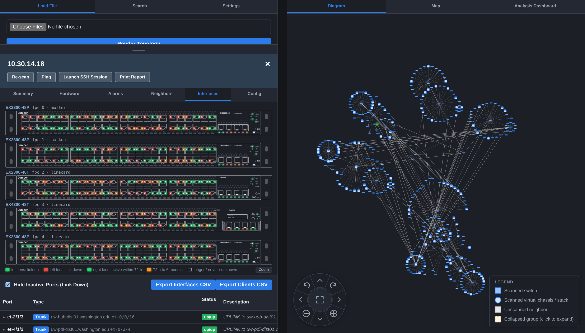

Below the art, the interface table pairs each port with its LLDP neighbor or its learned clients,
and exports to CSV.

### Find a MAC anywhere in the fleet, in any snapshot

Search covers IP, hostname, MAC, config username and serial number, across **every loaded snapshot at
once** — so a device that moved shows up on each date it was seen.

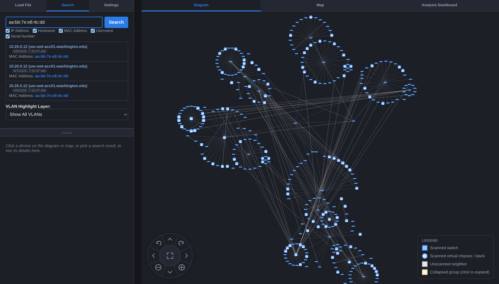

### Fleet health at a glance

Counts that matter, plus the outliers ranked: hottest REs, fullest memory, boxes that rebooted in the
last hour, dot1x violations, daisy-chained ports. Thresholds are yours to set in Settings.

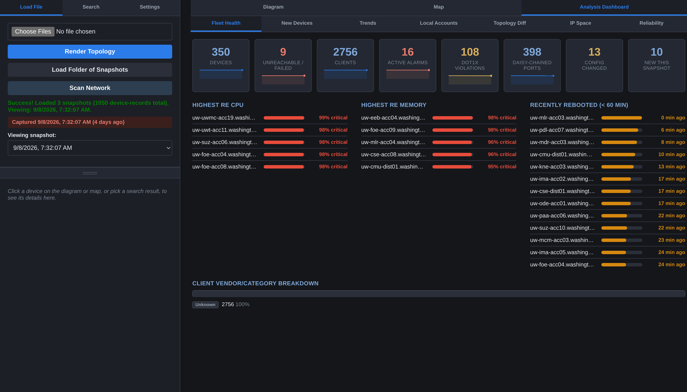

### What changed since the last crawl

Two snapshots, diffed. Devices and links added and removed, and devices whose IP moved but whose
serial says they're the same box.

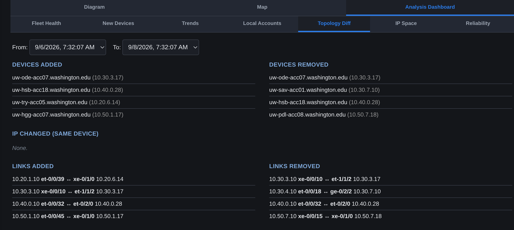

Per device, the same idea applied to the running config — a real line-by-line diff against an earlier
capture of that same switch (matched by serial, so a renumbered device still lines up), or against any
other device in the fleet if you want to know why two boxes behave differently.

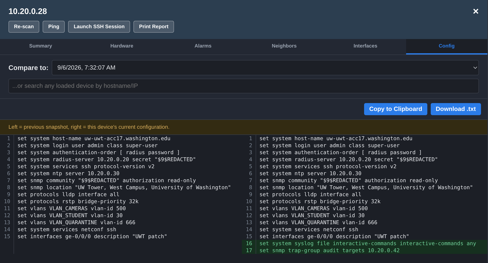

### Alarms and reboots over time

A heatmap of every device that recorded an alarm or a reboot across the crawls you have. Quiet devices
are hidden by default; click a cell to open that device's alarms.

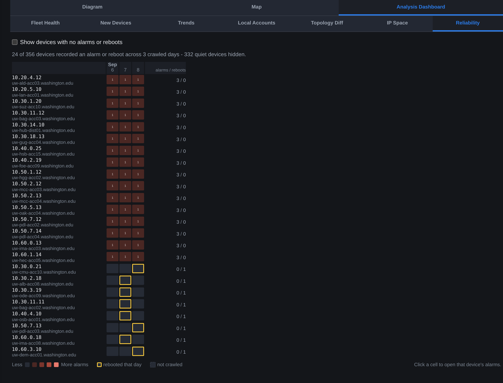

### Where the box physically is

Pin devices to a map with building and room. Coordinates are stored against the **serial number**, so
re-addressing a switch doesn't lose its location. Devices with no location set are listed for you to
work through.

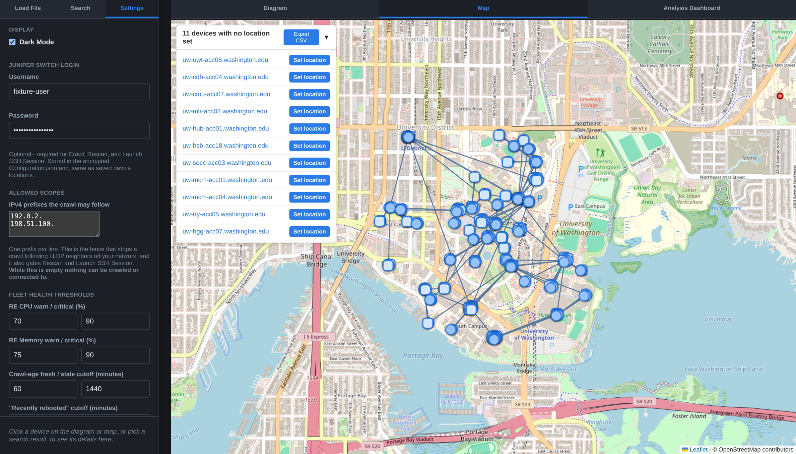

---

## How the crawl works

One seed IP, LLDP for discovery, and a bounded work queue. Each device is one SSH session running one
batch of `show` commands; its LLDP neighbors become new queue entries if — and only if — they fall
inside the allowed scopes you configured.

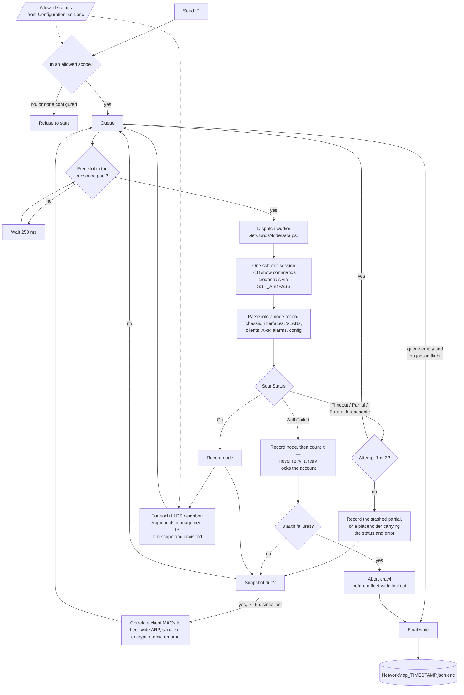

Details worth knowing:

- **The snapshot is written continuously**, not at the end. A crawl interrupted at any point leaves a
  valid file holding everything gathered so far. The write interval backs off as the fleet grows
  (5 s → up to 120 s) so serialization doesn't starve the dispatch loop.
- **Failures are recorded, not dropped.** A device that timed out appears in the output with
  `ScanStatus` and an error string, so "unreachable" is distinguishable from "isolated leaf switch".
  A retry that produces nothing keeps the partial data from the first attempt.
- **Hung sessions are reaped.** A worker is abandoned after 145 s, and its orphaned `ssh.exe` — an
  OS-level grandchild PowerShell can't see — is matched by command line and creation time, then killed.
- **`AuthFailed` is never retried**, and three auth failures abort the whole crawl. One mistyped
  password should not lock the account out on 350 switches.
- **Snapshots are keyed by serial**, not IP, so history and diffing survive renumbering.

Per device, the batch runs `show version`, `virtual-chassis`, `chassis hardware`, `route 0/0 exact`,
`interfaces terse`, `interfaces descriptions`, `spanning-tree interface`, `poe interface`,
`dot1x interface`, `lldp neighbors detail`, `vlans`, `ethernet-switching table`, `arp no-resolve`,
`system uptime`, `chassis alarms`, `chassis routing-engine`, `configuration | display set`, and
`interfaces extensive` — read-only, in one session, capped at 120 s.

### At runtime

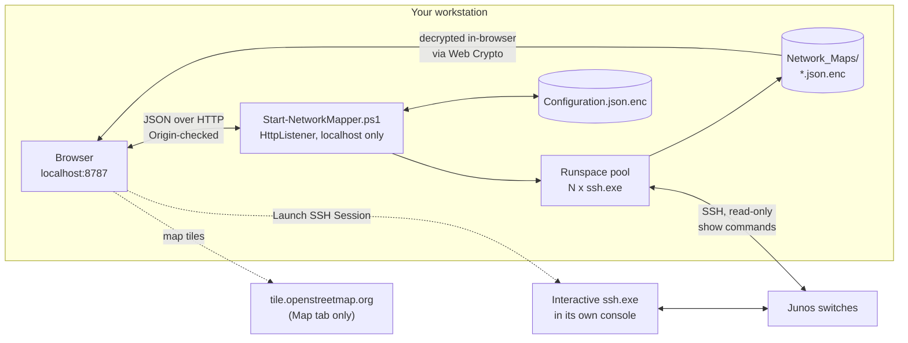

The web server binds `localhost` and refuses cross-origin requests. The one outbound connection that
isn't SSH to a switch you named is the Map tab's tile fetch from `tile.openstreetmap.org` — see
[Limits](#limits-stated-plainly).

---

## Security and accountability

**Threat model.** One operator, their own workstation, a fleet they are already authorized on. The
tool's job is to make sure that *their* credential is the one used, that it is not left lying around
in plaintext, and that the crawl cannot wander outside the network they intended.

### You supply your own credentials — there is no shared account

There is no default, bundled, or embedded credential anywhere in this repository — and no default
network prefix either. On first run the Juniper login and the allowed scopes are both blank; you type
yours into the **Settings** tab, and they are written to `Configuration.json.enc` under an encryption
password only you know.

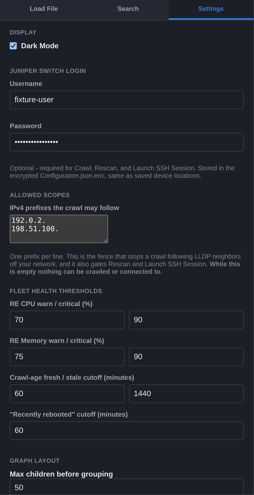


The consequence is the point: **every command the crawler runs arrives at the switch as whoever is
sitting at the keyboard.** The tool never substitutes, pools, or provisions a credential — it uses the
one you typed and nothing else. So the audit trail is exactly as personal as that login: enter a named
account and Junos accounting, `syslog interactive-commands`, and your RADIUS/TACACS+ server attribute
the session to a named human, exactly as if you had typed it. Enter a shared `admin` and you get a
shared `admin` in the logs — the tool can't fix that, but it also can't be what caused it. Nothing here
creates a service account, a shared vault, or a credential that outlives the person using it.

A crawl is also deliberately conspicuous: one SSH login per device, all read-only `show` commands, all
timestamped by the devices themselves. It is designed to be legible in the switch's own audit log, not
invisible in it.

### How the credentials are protected

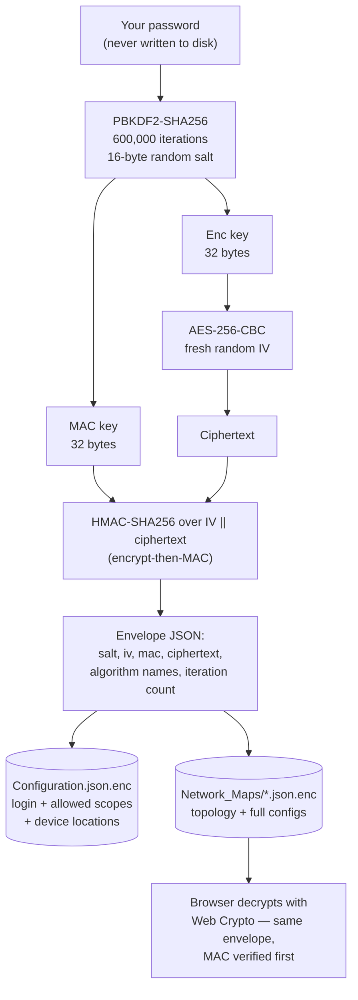

- **AES-256-CBC with HMAC-SHA256 over the IV and ciphertext, encrypt-then-MAC.** The MAC is verified
  *before* any decryption, so a wrong password produces one clear error rather than a padding
  exception, and a tampered file is rejected outright.
- **PBKDF2-SHA256, 600,000 iterations**, salt and iteration count stored per envelope so the cost can
  be raised later without breaking old files.
- **The same envelope format is implemented twice** — in PowerShell and in the browser's Web Crypto
  API — so an encrypted snapshot opens in the viewer without ever being written to disk in the clear.
- **Snapshot encryption is on by default, and for good reason:** a snapshot contains every device's
  complete `show configuration | display set` output — unredacted, `$9$` secrets included, for the
  whole fleet in one file. Turning it off takes an explicit `-NoEncryption`, and when it is off the
  file is created empty, ACL-hardened to your user alone, *and only then* written.
- **It fails closed.** If encryption was requested but no key material could be derived, the crawl
  refuses to run rather than silently writing plaintext. If `Configuration.json.enc` could not be
  decrypted at startup, saving settings is disabled rather than rewriting the file under an unverified
  password — and new snapshots still get encrypted, under a separate password you're prompted for.
- **The password does cross loopback, deliberately, and you should know where.** Two endpoints are the
  exceptions to "the password stays in the PowerShell process":
  - `GET /api/session-password` hands the browser the startup encryption password so opening a
    snapshot doesn't re-prompt. It is `Cache-Control: no-store` and same-origin gated despite being a
    GET, because a leak decrypts every archived snapshot offline. Start the server with a password it
    can't verify and this returns nothing — the viewer prompts you instead.
  - `GET /api/config` returns `Configuration.json[.enc]` verbatim so the Settings tab can populate. Under
    encryption that's the envelope, decrypted in the browser; under `-NoEncryption` it is the Juniper
    password in the clear. Either way the browser ends up holding it, which is what lets the Settings
    field show as populated.

  Saving settings goes the other way: the browser posts plaintext config *to the local server*, which
  encrypts it there. Neither password is ever written to a log.

### Credential handling in flight

`ssh.exe` has no way to accept a password on stdin, so it is handed over through `SSH_ASKPASS`. Those
temp files are the one moment a password exists on disk, and they are treated accordingly: created
empty, ACL-stripped to a single full-control ACE for the current user, written, and removed in a
`finally` block. The crawl and the connect path each also sweep `%TEMP%` on entry for files a
previously killed run left behind, age-gated at 4 hours so a concurrent session's files survive.

### Blast-radius controls

| Control | Where |
|---|---|
| Allowed-scopes fence — the crawl won't follow a neighbor outside it. Configured in Settings, no default, **fail-closed when unset**: an empty list matches nothing, so every path below is refused until you set one | CLI seed IP, every discovered neighbor, `/api/connect`, `/api/rescan`, browser-initiated scans |
| Scope entries validated as dotted IPv4 prefixes with in-range octets | On save, in the browser and again server-side — a typo'd prefix would otherwise silently fence nothing |
| Username validated against `^[A-Za-z0-9][A-Za-z0-9._-]{0,31}$` | At save time *and* again at the single `ssh.exe` argument builder every caller funnels through |
| Target IP validated as four 0–255 octets | Same choke point — closes command injection even for values that bypassed the save-time check |
| Web server bound to `localhost` only | `HttpListener` prefix |
| Same-origin check on every API call, failing closed when `Origin` and `Referer` are both absent | Guards against DNS rebinding and drive-by requests from other pages |
| Static file serving scoped to the visualizer path alone | `lib/*.ps1` and the debug logs are never served; snapshots come only from the path-confined `/api/snapshot` |
| Snapshot names matched against an anchored pattern *and* path-confined to `Network_Maps/` | Blocks traversal via the snapshot API |
| Auth-failure circuit breaker (3 strikes, no retry on `AuthFailed`) | Prevents a typo from locking the account fleet-wide |
| Configs redacted from `-Log` raw dumps | Raw dumps are for debugging parse failures, not for holding secrets |

### An audit surface of its own

The **Local Accounts** tab reads every `set system login user` line out of the captured configs and
lists them fleet-wide, alongside the one objective check it can make: whether that device has
centralized RADIUS/TACACS+ authentication configured at all. Usernames are never auto-flagged as
suspicious — this is a review aid, not a verdict.

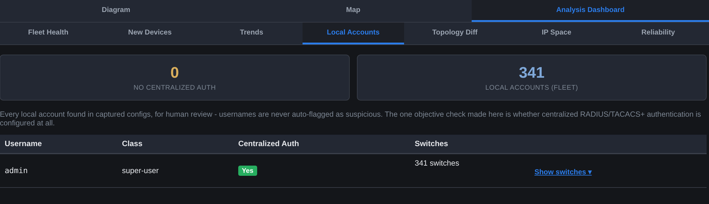

Combined with config diffing, this answers "did someone add a local account to a switch last week"
without a config-management system.

### Limits, stated plainly

- **The Map tab fetches tiles from `tile.openstreetmap.org`.** It is the only outbound connection that
  isn't SSH to a switch you named, and the tile requests disclose roughly where your fleet is to a
  third party. Everything else — Leaflet, vis-network, the OUI database — is vendored locally. Stay off
  the Map tab, or point `web-src/map.js`'s `L.tileLayer` at an internal tile server and rebuild.
- The local web server is **unauthenticated**. It binds localhost and checks origins, but anything
  running as your user on your machine can reach it, and it holds switch credentials in memory. It is
  safe only while the person at the keyboard and the process owner are the same person. Stop it when
  you're done.
- **No TLS on localhost.** Traffic between your browser and the server is plaintext loopback.
- **The encryption password lives in browser memory** for the life of the tab, and in the PowerShell
  process for the life of the session.
- **`StrictHostKeyChecking=no`, and host keys are not stored.** This suits frequently-reimaged internal
  switches; it does not defend against an on-path attacker inside your management network.
- **Password authentication only** (`PubkeyAuthentication=no`), because the askpass path requires it.
  If your fleet is key-only, this tool does not currently fit.
- **The HMAC comparison is not constant-time.** Acceptable for a localhost-only, single-operator tool;
  not a claim of resistance to a timing oracle.
- **ACL hardening is Windows-specific and best-effort.** It warns rather than throws, so treat it as
  defense in depth, not a guarantee.
- **There is no RBAC in the viewer.** Anyone who can open the snapshot and knows the password sees
  everything in it.

---

## Compared to the rest of the landscape

For completeness, since "why not just use X" is a fair question:

| | What it gives you | What it costs you |
|---|---|---|
| **LibreNMS / Observium / Netdisco** | Continuous monitoring, auto-generated topology from LLDP/CDP, historical graphs, alerting | A dedicated always-on server, MySQL or PostgreSQL, RRD storage, SNMP credentials on every device, and ongoing care |
| **SolarWinds NTM** | On-demand Layer 2/3 discovery and Visio export from a Windows desktop | Commercial, quote-only; SNMP/WMI across the fleet |
| **NetBrain / Auvik / Juniper Mist** | Enterprise mapping and automation platforms | Enterprise pricing, a collector or appliance in your network, a procurement conversation |
| **Oxidized / RANCID / Unimus** | Proper versioned config backup — git-native history, scheduled, fleet-wide | A daemon to run, and stored device credentials centralized on that host |
| **Junos PyEZ / JSNAPy / Ansible** | Agentless, laptop-friendly, scriptable, vendor-native | A Python toolchain and code you write; text and JSON output, no visual map, no fleet-wide LLDP stitching |
| **PuTTY / MobaXterm / Termius / mRemoteNG / Royal TS** | Organizing and opening *sessions* | Nothing about the fleet's state — one device, one tab, at a time |

Every one of these is better than this tool at the thing it was built for. If you need alerting when a
switch goes down, you need a monitoring platform, and this is not one. If you need a defensible,
scheduled, versioned config archive, you need Oxidized or its equivalents, and this is not one — a
crawl is something you chose to run, not a cron job.

What none of them is, is *already installed, with nothing to stand up, answering a question you have
right now.* That gap — between a terminal that shows you one box and a platform that needs a project
plan — is the entire reason this exists.

---

## Layout

- `Start-NetworkMapper.ps1` — entry point.
- `lib/` — crawl engine, SSH/Junos helpers, encryption, web server, and the built single-file
  visualizer (`Network_Visualizer.html`). This is everything a release needs; `web-src/` is not shipped.
- `web-src/` — dev source for the visualizer. Run `node web-src/tools/build-inline.mjs` to rebuild
  `lib/Network_Visualizer.html` after changing anything here.
- `Network_Maps/` — crawl output: one timestamped snapshot per run, used for history and diffing.
- `Configuration.json.enc` — Juniper login, allowed scopes, device locations (building, room, notes,
  map pins) and dashboard thresholds. Editable from the viewer's Settings tab.

### Working on the visualizer

Snapshots are gitignored — they hold real topology and real configs. To get a demo fleet:

```bash
cd web-src
node tools/generate-fixture.mjs --devices 350 --snapshots 3   # writes ../Network_Maps/
node --test test/*.test.mjs                                   # the JS test suite (215 tests)
```

Then `.\Start-NetworkMapper.ps1 -NoEncryption` to view it. Every screenshot in this README is that
fixture — the hostnames, serials and locations in them are synthetic.

`.\Run-Tests.ps1` covers the PowerShell side.

### Encrypting or decrypting a file offline

`lib/Protect-MapperFile.ps1` converts a snapshot or `Configuration.json[.enc]` between plaintext and
the encrypted envelope, outside a live session — to inspect an encrypted file, re-encrypt a
`-NoEncryption` snapshot, rotate onto a new password, or hand a decrypted copy to another tool.
Nothing calls it automatically.

```powershell
cd PS_NetworkMapper\lib

.\Protect-MapperFile.ps1 -InputFile ..\Network_Maps\NetworkMap_2026-08-28_120000.json          # encrypt
.\Protect-MapperFile.ps1 -InputFile ..\Network_Maps\NetworkMap_2026-08-28_120000.json.enc -Decrypt
.\Protect-MapperFile.ps1 -InputFile ..\Configuration.json.enc -Decrypt -OutputFile plain.json
```

| Parameter | Default | Description |
|---|---|---|
| `-InputFile` | *(required)* | File to encrypt or decrypt. |
| `-OutputFile` | *(derived)* | Encrypting: input + `.enc`. Decrypting: `.enc` stripped, or `<input>.decrypted.json`. |
| `-Decrypt` | off | Reverses the default action. |
| `-Type` | `Auto` | Envelope format to stamp when encrypting. `Auto` detects `Configuration.json(.enc)` as `Config`, anything else as `Topology`; a config stamped with the wrong format is rejected at load. |
| `-Password` | *(prompted)* | A `[securestring]`, for non-interactive use. |
| `-Force` | off | Skip the overwrite confirmation. |

It refuses to double-wrap an already-encrypted file, verifies the HMAC before decrypting, and supports
`-WhatIf`/`-Confirm`.
